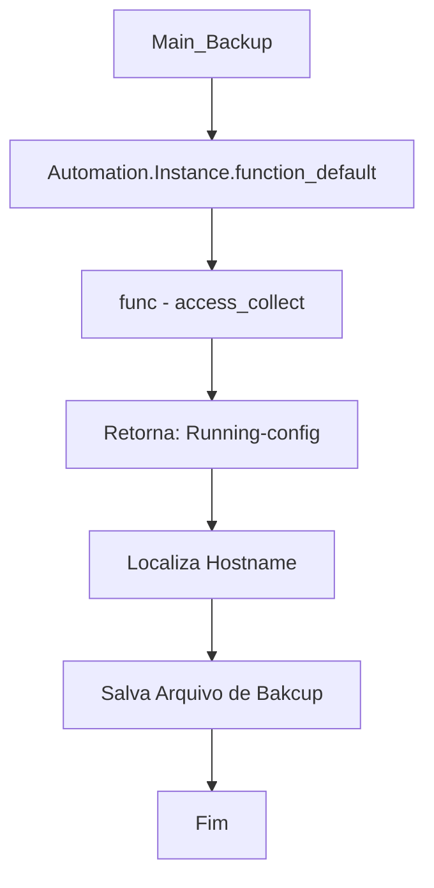
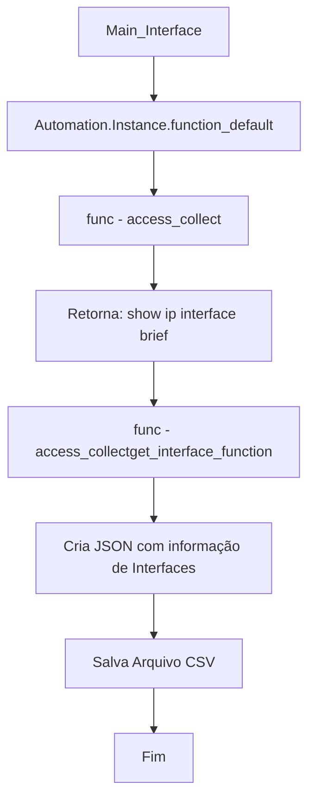
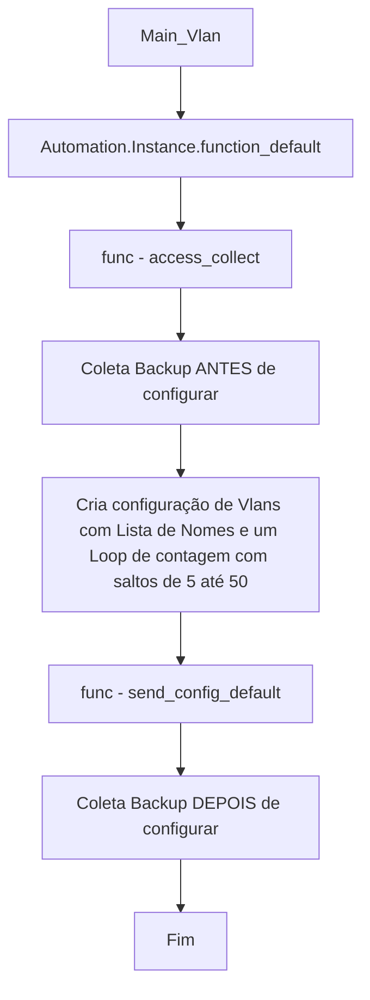

<h1>
Fluxograma de funcionamento da Automação e suas Dependencias
</h1>

<h2>
Rotina de Backup
</h2>

```mermaid
flowchart TD
    A[Main_Backup] --> B[Automation.Instance.function_default]
    B --> C[func - access_collect]
    C --> D[Retorna: Running-config]
    D --> E[Localiza Hostname]
    E --> F[Salva Arquivo de Bakcup]
    F --> G[Fim]
```
---

<h2>
Relatório de Interfaces
</h2>

```mermaid
flowchart TD
    A[Main_Interface] --> B[Automation.Instance.function_default]
    B --> C[func - access_collect]
    C --> D[Retorna: show ip interface brief]
    D --> E[func - access_collectget_interface_function]
    E --> F[Cria JSON com informação de Interfaces]
    F --> G[Salva Arquivo CSV]
    G --> H[Fim]
``` 
---

<h2>
Configuração de VLANs
</h2>
 

```mermaid
flowchart TD
    A[Main_Vlan] --> B[Automation.Instance.function_default]
    B --> C[func - access_collect]
    C --> D[Coleta Backup ANTES de configurar]
    D --> E[Cria configuração de Vlans com Lista de Nomes e um Loop de contagem com saltos de 5 até 50]
    E --> F[func - send_config_default]
    F --> G[Coleta Backup DEPOIS de configurar]
    G --> H[Fim] 
```