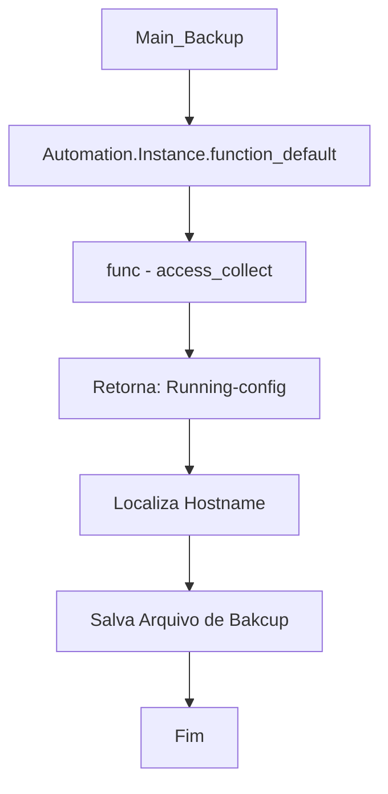
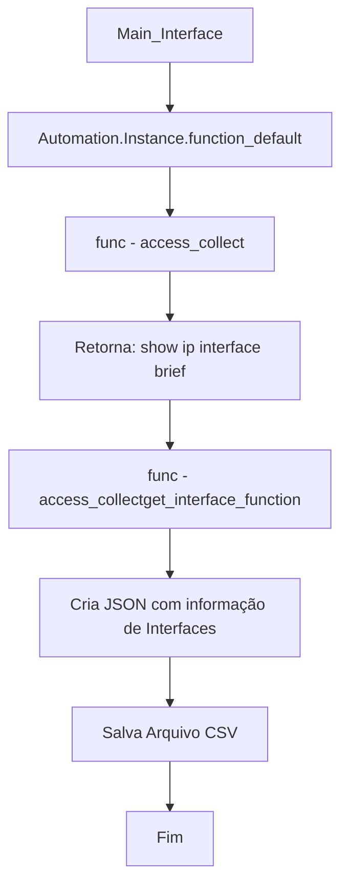
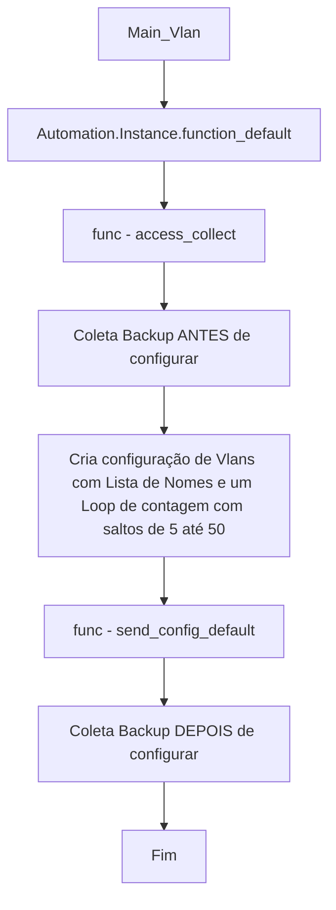

<h1>
Fluxograma de funcionamento da Automação e suas Dependencias
</h1>

Abaixo um Fluxograma exemplificando o processo de cada automação do projeto, e todas estão buscando acessando [Instancias](https://github.com/ozumaru/CiscoDevNet---Python/tree/master/Documents/Projetos/Primeiro/Ambiente/Automation/Instance/instances.md) para realizar alguma ação, seja para:
 - Acessar algum device e coletar comados
 - Aplicar configuração
 - Tratar informação de Status de Interfaces
 
# Rotina de Backup - Link: [BACKUP](https://github.com/ozumaru/CiscoDevNet---Python/tree/master/Documents/Projetos/Primeiro/Ambiente/Automation/BACKUP/main_backup.md)
 - Videos: [Parte 1](https://www.youtube.com/watch?v=vY-c34QwUiY) \ [Parte 2](https://www.youtube.com/watch?v=KFq3nfDjUY8) \ [Parte 3](https://www.youtube.com/watch?v=Gvr0oQE7o6M)

---
# Relatório de Interfaces - Link: [INTERFACE](https://github.com/ozumaru/CiscoDevNet---Python/tree/master/Documents/Projetos/Primeiro/Ambiente/Automation/INTERFACE/main_interface.md)
 - Videos: [Parte 1](https://youtu.be/NHoNt21UnJs) \ [Parte 2](https://youtu.be/d-3HldELBnM) \ [Parte 3](https://www.youtube.com/watch?v=Hl1G6pDfuDA) \ [Parte 4](https://youtu.be/kl-Lj_iU0VY)

---
# Configuração de VLANs - Link: [VLAN](https://github.com/ozumaru/CiscoDevNet---Python/tree/master/Documents/Projetos/Primeiro/Ambiente/Automation/VLAN/main_vlan.md)

---
Links:
\
Inicio do Projeto: [Inicio](https://github.com/ozumaru/CiscoDevNet---Python/blob/master/Documents/Projetos/Primeiro)